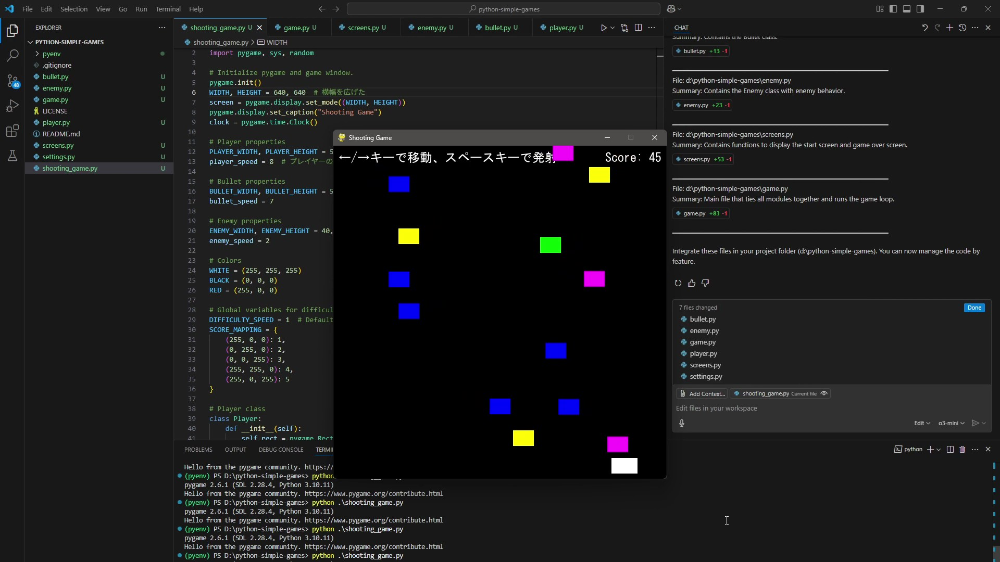

# シューティングゲーム / Shooting Game

このシューティングゲームでは、プレイヤーが左右に移動し、上から降ってくる敵キャラクターを撃って得点を稼ぐことを目的としています。  
In this shooting game, the player moves left and right and shoots enemies falling from above to score points.

[](https://youtu.be/aVMjw5FUkTY)

## 実行方法 / How to Run

1. このフォルダ内のターミナル（またはコマンドプロンプト）を開いてください。  
   Open a terminal (or command prompt) in this folder.
2. 必要なPythonパッケージをインストールしてください。  
   Install the required Python packages:
   ```
   pip install pygame
   ```
3. 次のコマンドを実行してください。  
   Run the following command:
   ```
   python game.py
   ```

どうぞゲームを楽しんでください！  
Enjoy the game!
